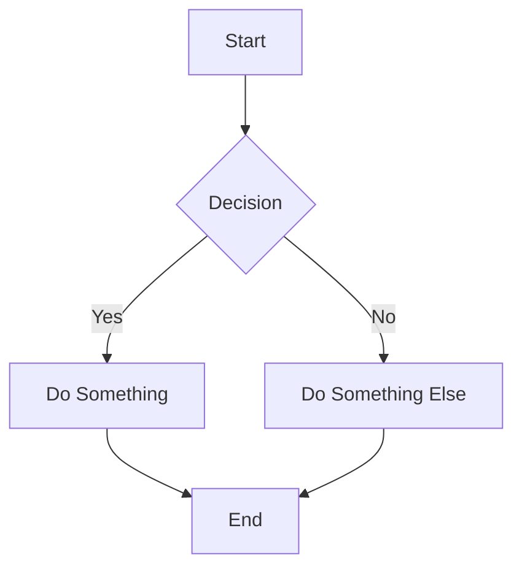
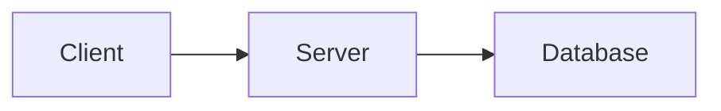
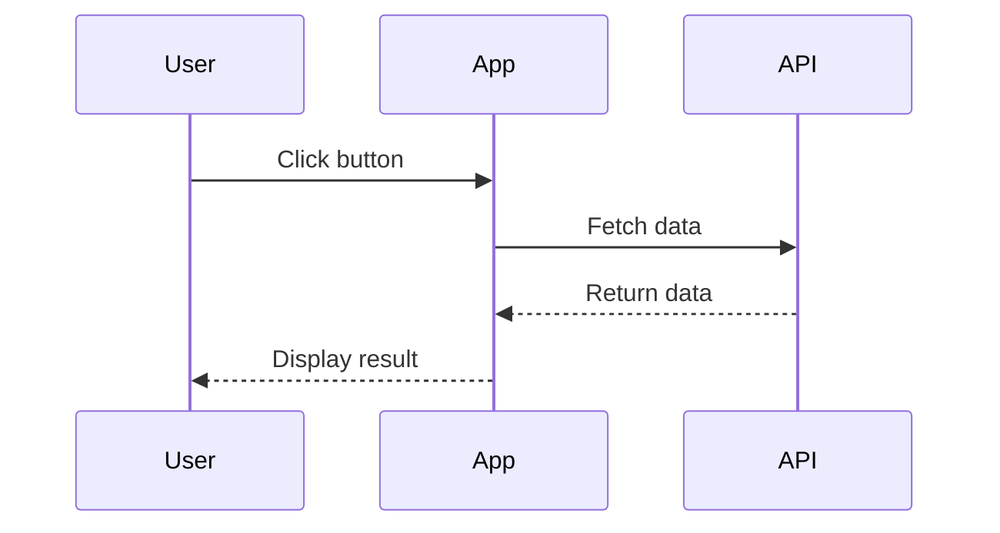

# MDX and Content Guide

## MDX Basics

MDX files combine Markdown with JSX components. All workshop content uses MDX (`.mdx` extension).

## Code Blocks

### Basic Code Block

````mdx
```tsx
function Hello() {
  return <div>Hello World</div>
}
```
````

### Code Block Options

Code blocks support several options from `@kentcdodds/md-temp`:

````mdx
```tsx filename=app/components/hello.tsx nocopy nonumber remove=1,3-5 add=2,6-8 lines=3,9-12
// This line will be marked for removal (line 1)
// This line will be marked for addition (line 2)
// This line will be highlighted (line 3)
```
````

### Options Reference

| Option | Purpose | Example |
|--------|---------|---------|
| `filename` | Show filename header | `filename=app/root.tsx` |
| `nocopy` | Hide copy button | `nocopy` |
| `nonumber` | Hide line numbers | `nonumber` |
| `lines` | Highlight specific lines | `lines=3,9-12` |
| `add` | Mark lines as added (green) | `add=2,6-8` |
| `remove` | Mark lines as removed (red) | `remove=1,3-5` |

### Shell Commands

Shell commands with `sh` language don't get line numbers by default:

````mdx
```sh nonumber
npm install react react-dom
```
````

## Callouts

Callouts draw attention to important information:

### Callout Types

```mdx
<callout-muted>Gray - less important notes</callout-muted>

<callout-info>Blue - helpful information</callout-info>

<callout-warning>Yellow - things to be careful about</callout-warning>

<callout-danger>Red - critical warnings</callout-danger>

<callout-success>Green - positive reinforcement</callout-success>
```

### Callout Classes

```mdx
<callout-info class="aside">
Smaller text for tangential information
</callout-info>

<callout-warning class="important">
Larger, bold text for critical information
</callout-warning>

<callout-danger class="notification">
<div className="title">Warning Title</div>
Notification style with title (warning/danger only)
</callout-danger>
```

## Built-in Components

### InlineFile

Link to open a file in the editor:

```mdx
<InlineFile file="app/root.tsx" />
```

With custom text:

```mdx
<InlineFile file="app/root.tsx">Open the root file</InlineFile>
```

### LinkToApp

Link to a page in the running app:

```mdx
<LinkToApp to="/dashboard" />
```

With custom text:

```mdx
<LinkToApp to="/dashboard">Go to the dashboard</LinkToApp>
```

### DiffLink

Link to show a diff between two exercise steps:

```mdx
<!-- Using search params format -->
<DiffLink to="app1=01.01.problem&app2=01.01.solution">
  See the diff
</DiffLink>

<!-- Using app1/app2 props -->
<DiffLink app1="01/01.problem" app2="01/01.solution">
  View changes
</DiffLink>

<!-- Using relative offsets -->
<DiffLink app1={0} app2={1}>
  See what changes
</DiffLink>
```

### NextDiffLink and PrevDiffLink

Shortcuts for adjacent diffs:

```mdx
<NextDiffLink>Check the upcoming changes</NextDiffLink>
<PrevDiffLink>Check the changes that were made</PrevDiffLink>
```

### EpicVideo

Embed an EpicWeb/EpicReact video:

```mdx
<EpicVideo url="https://www.epicweb.dev/workshops/full-stack-foundations/styling/intro" />
```

### VideoEmbed

Embed any video (YouTube, etc.):

```mdx
<VideoEmbed
  title="React Fundamentals Theme Song"
  url="https://www.youtube.com/embed/UWYzrMwwHKI"
/>
```

## Mermaid Diagrams

Create diagrams using Mermaid:

````mdx

````

### Useful Diagram Types

**Flowchart:**
````mdx

````

**Sequence Diagram:**
````mdx

````

## Content Writing Guidelines

### Voice and Tone

1. **Conversational** - Write like you're talking to a colleague
2. **Encouraging** - Celebrate progress, don't criticize mistakes
3. **Clear** - Use simple language, avoid jargon
4. **Active** - Use active voice ("Click the button" not "The button should be clicked")

### Using Emoji Characters

The workshop has established characters:

| Emoji | Character | Purpose |
|-------|-----------|---------|
| 👨‍💼 | Peter the Product Manager | Requirements, context, user needs |
| 🐨 | Kody the Koala | Direct instructions, what to do |
| 🦺 | Lily the Life Jacket | TypeScript-specific guidance |
| 💰 | Money Bag | Code hints, solutions |
| 📜 | Scroll | Documentation links |
| 💣 | Bomb | Things to remove |
| 🧝‍♂️ | Elf | Extra credit challenges |
| 🦉 | Owl | Wisdom, deeper explanations |
| 💯 | Hundred | Best practices |

### Formatting Best Practices

**Use code formatting for:**
- File names: `app/root.tsx`
- Function names: `useState`
- Variable names: `count`
- Commands: `npm install`
- Key names: `Enter`

**Use bold for:**
- Important terms on first use
- Emphasis in instructions

**Use italics for:**
- Introducing concepts
- Subtle emphasis

### Common Patterns

**Introducing a concept:**
```mdx
# Using useState

The `useState` hook lets you add state to functional components. When state
changes, React re-renders the component with the new value.

```tsx
const [count, setCount] = useState(0)
```

In this exercise, you'll add state to track...
```

**Giving instructions:**
```mdx
👨‍💼 Users want to see their profile information on the dashboard.

🐨 Open <InlineFile file="app/routes/dashboard.tsx" /> and:

1. Import the `useUser` hook from `~/utils/user`
2. Call `useUser()` at the top of the component
3. Display the user's name in the header

💰 Here's how to import the hook:
```tsx
import { useUser } from '~/utils/user'
```
```

**Providing context:**
```mdx
<callout-info>
You might wonder why we use `useState` instead of a regular variable. The key
difference is that `useState` tells React to re-render when the value changes.
A regular variable would change, but React wouldn't know to update the UI.
</callout-info>
```

**Warning about common mistakes:**
```mdx
<callout-warning>
Don't call hooks inside conditions or loops! React relies on hooks being
called in the same order every render. Putting them in conditions breaks this.
</callout-warning>
```

## Complete README.mdx Examples

### Workshop Introduction

```mdx
# React Fundamentals ⚛

<EpicVideo url="https://www.epicreact.dev/workshops/react-fundamentals/intro" />

👨‍💼 Hello! I'm Peter the Product Manager and I'm here to help you understand
what users need so you can build great React applications!

In this workshop, we'll cover the fundamentals you need to build React apps:

1. Creating elements with JavaScript
2. Using JSX for cleaner syntax
3. Building reusable components
4. Adding TypeScript for type safety
5. Styling components
6. Handling forms
7. Managing errors
8. Rendering lists

<callout-info>
The first few exercises use plain HTML files to keep things simple. Later
exercises use TypeScript for a more realistic development experience.
</callout-info>

Let's get started!
```

### Problem Instruction

```mdx
# Creating a Custom Hook

<EpicVideo url="https://www.epicweb.dev/workshops/advanced-react/custom-hooks" />

👨‍💼 We have logic for managing a counter that's duplicated in several
components. Let's extract it into a reusable custom hook!

🐨 Open <InlineFile file="src/hooks/use-counter.ts" /> and create a
`useCounter` hook that:

1. Accepts an optional `initialValue` parameter (default: 0)
2. Returns an object with:
   - `count` - the current count
   - `increment` - function to add 1
   - `decrement` - function to subtract 1
   - `reset` - function to reset to initial value

💰 Here's the function signature to get you started:

```ts
export function useCounter(initialValue = 0) {
  // Your implementation here
}
```

📜 [React Custom Hooks Documentation](https://react.dev/learn/reusing-logic-with-custom-hooks)
```

### Solution Confirmation

```mdx
# Creating a Custom Hook

<EpicVideo url="https://www.epicweb.dev/workshops/advanced-react/custom-hooks/solution" />

👨‍💼 Excellent! Now we have a reusable `useCounter` hook that any component
can use. Notice how the hook encapsulates all the counter logic, making our
components simpler.

Key insights:
- Custom hooks are just functions that use other hooks
- They must start with `use` to follow React's rules
- They can accept parameters and return anything

Let's see how to test this hook next.
```

### Exercise Finished

```mdx
# Custom Hooks

<EpicVideo url="https://www.epicweb.dev/workshops/advanced-react/custom-hooks/finished" />

👨‍💼 Great work! You've learned how to extract reusable logic into custom hooks.

Remember:
- 🎯 Hooks help share stateful logic between components
- 📏 Custom hooks follow the same rules as built-in hooks
- 🧪 Hooks are easy to test in isolation

Now you're ready to tackle more advanced patterns!
```
