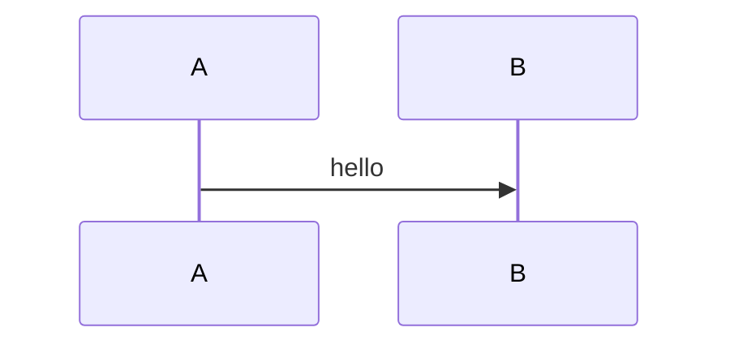

# MDX style guide (Epic Workshop format)

Epic Workshops rely heavily on MDX for instructions. Consistency matters because learners scan.

## Code blocks

Epic Workshop MDX supports code block options (from `@kentcdodds/md-temp`).

Example options:

````mdx
```tsx filename=app/filename.tsx nocopy nonumber remove=1,3-5 add=2,6-8 lines=3,9-12
// code...
```
````

Notes:

- `sh` blocks may not auto-number; add `nonumber` when desired.
- Prefer `filename=...` for “look here” snippets.
- Use `remove=` and `add=` when teaching diffs inside instructions.

## Callouts

Available callout components:

- `<callout-muted>` (gray)
- `<callout-info>` (blue)
- `<callout-warning>` (yellow)
- `<callout-danger>` (red)
- `<callout-success>` (green)

Optional classes:

- `class="aside"`: smaller helper text
- `class="important"`: larger/bolder emphasis
- `class="notification"`: supports a title (warning/danger only)

## Useful MDX components

### `InlineFile`

Use to link to a file learners should open:

```mdx
<InlineFile file="app/root.tsx" />
<InlineFile file="index.html">Open the step file</InlineFile>
```

### `LinkToApp`

Use to link to a route in the running app:

```mdx
<LinkToApp to="/dashboard" />
<LinkToApp to="/dashboard">Go to dashboard</LinkToApp>
```

### `DiffLink`, `NextDiffLink`, `PrevDiffLink`

Use to send learners straight to a diff.

Example:

```mdx
<DiffLink app1="02/01.solution" app2="02/02.problem">
	Compare these two steps
</DiffLink>
```

Shortcuts:

```mdx
<NextDiffLink>Check the upcoming changes</NextDiffLink>
<PrevDiffLink>Check the changes that were made</PrevDiffLink>
```

## Embedding videos

### `EpicVideo`

For launched/published workshops, embed the canonical Epic video:

```mdx
<EpicVideo url="https://www.epicweb.dev/workshops/.../some-lesson" />
```

### `VideoEmbed`

For non-Epic videos:

```mdx
<VideoEmbed
	title="Some title"
	url="https://www.youtube.com/embed/..."
/>
```

## Mermaid diagrams

Mermaid is supported:

````mdx

````

Use diagrams when a concept is hard to explain text-only (protocol flows, lifecycles, pipelines).

